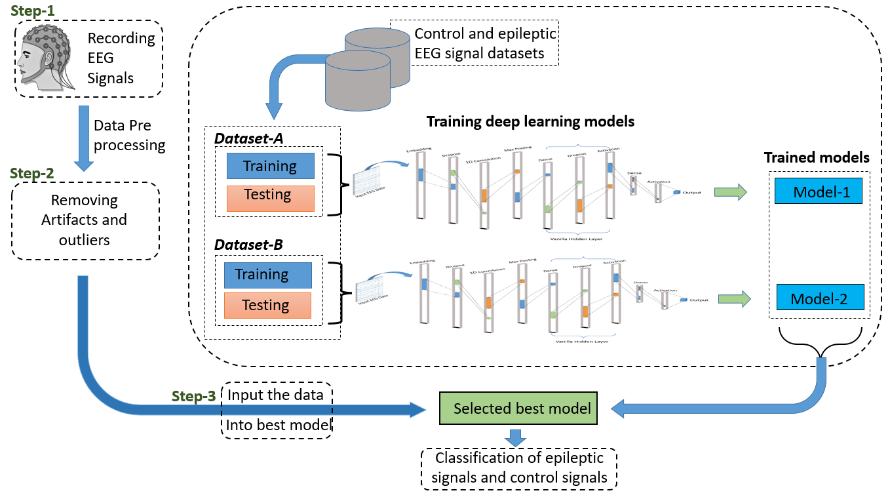

# Epilipsy-Detection-using-the-CNN

## Description

In this study, we have proposed a one-dimensional Convolutional Neural network (CNN) for the automatic detection of epilepsy seizures. The automated process might be convenient in the situations where a neurologist is unavailable and also help the neurologists in proper analysis of EEG signals and case diagnosis. We have used two publicly available EEG datasets, which were collected from the two African countries, Guinea-Bissau and Nigeria.

## Workflow

## Citation

If you use [Epilipsy Code](https://github.com/manojkaushik/Epilipsy-Detection-using-the-CNN) code in your research, we would appreciate a citation to both the original paper:

	@article{kaushik2022deep,
	  title={A deep learning approach for epilepsy seizure detection using EEG signals},
	  author={Kaushik, Manoj and Singh, Divyanshu and Dutta, Malay Kishore and Gonz{\'a}lez, Carlos Manuel Travieso},
	  journal={Tecnolog{\'\i}a en Marcha},
	  volume={35},
	  number={4},
	  pages={110--118},
	  year={2022},
	  publisher={Editorial Tecnol{\'o}gica de Costa Rica}
	}

	